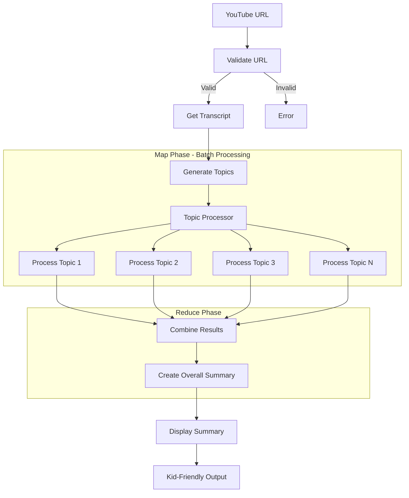

# YouTube Summarizer for Kids - Chrome Extension

<div align="center">

🎬 **Create kid-friendly summaries of YouTube videos with Q&A pairs and simple explanations** 🎬

[](https://developer.chrome.com/docs/extensions/mv3/)
[](LICENSE)
[](README.md)

</div>

## 🌟 Overview

This Chrome Extension creates child-friendly summaries of YouTube videos, making complex content accessible to children aged 3-12. Built following the **PocketFlow design system** with a **Map-Reduce architecture** for efficient topic processing.

### ✨ Key Features

- 🎯 **Kid-Friendly Summaries**: Converts complex video content into simple, age-appropriate explanations
- ❓ **Interactive Q&A**: Generates engaging question-answer pairs for each topic
- 🎨 **Beautiful Design**: Colorful, engaging interface designed specifically for children
- 🔧 **Age Customization**: Adjustable content complexity for different age groups (3-5, 6-8, 9-12 years)
- 🌍 **Multilingual Support**: Summary generation in multiple languages
- ♿ **Accessibility Features**: Large fonts, high contrast mode, and text-to-speech ready
- 🚀 **Manifest V3**: Modern, secure Chrome Extension architecture
- 🤖 **AI-Powered**: Uses Google's Gemini API for intelligent content processing

## 🏗️ Architecture

This extension implements the **PocketFlow design pattern** with a **Map-Reduce approach**:

### Flow Design (Based on PocketFlow Principles)



### Node Implementation

Following PocketFlow's node-based architecture:

1. **ValidateURL Node**: Validates YouTube URLs
2. **GetTranscript Node**: Extracts video transcripts and metadata
3. **GenerateTopics Node**: Identifies main topics using AI
4. **TopicProcessor BatchNode**: Processes each topic independently (Map phase)
5. **CombineTopics Node**: Combines and refines results (Reduce phase)
6. **CreateSummary Node**: Generates overall child-friendly summary

## 🚀 Installation

### Prerequisites

1. **Google Chrome** browser (or Chromium-based browser)
2. **Gemini API Key** from [Google AI Studio](https://makersuite.google.com/app/apikey)

### Development Installation

1. **Clone/Download** this repository:
   ```bash
   git clone <repository-url>
   cd youtube-summarizer-extension
   ```

2. **Add Extension Icons**: 
   - Create or add PNG icon files in the `images/` folder
   - Required sizes: 16x16, 32x32, 48x48, 128x128 pixels
   - See `images/README.md` for design guidelines

3. **Load Extension in Chrome**:
   - Open Chrome and navigate to `chrome://extensions/`
   - Enable "Developer mode" (toggle in top right)
   - Click "Load unpacked"
   - Select the `youtube-summarizer-extension` folder

4. **Configure API Key**:
   - Click the extension icon in Chrome toolbar
   - Click "Settings" or right-click extension → "Options"
   - Enter your Gemini API key
   - Save settings

### Production Installation

*Once published to Chrome Web Store:*

1. Visit the Chrome Web Store listing
2. Click "Add to Chrome"
3. Configure your Gemini API key in extension options

## 🎮 Usage

### Basic Usage

1. **Navigate** to any YouTube video
2. **Look for** the "🎬 Kid-Friendly Summary" button (appears automatically)
3. **Select** your child's age group (3-5, 6-8, or 9-12 years)
4. **Click** "Create Kid-Friendly Summary"
5. **Read** the generated summary with Q&A pairs!

### Advanced Features

#### Age Customization
- **3-5 years**: Very simple words and basic concepts
- **6-8 years**: Elementary school level explanations  
- **9-12 years**: More detailed but still kid-friendly content

#### Accessibility Options
- **Large Fonts**: Increase text size for better readability
- **High Contrast**: Enhanced visibility for visual impairments
- **Text-to-Speech**: Audio reading support (coming soon)

#### Language Support
Choose from multiple languages for summary generation:
- English, Spanish, French, German, Italian, Portuguese
- Chinese, Japanese, Korean (requires video captions in target language)

## ⚙️ Configuration

### API Key Setup

1. **Get API Key**:
   - Visit [Google AI Studio](https://makersuite.google.com/app/apikey)
   - Sign in with Google account
   - Create a new API key
   - Copy the key securely

2. **Configure Extension**:
   - Open extension options page
   - Paste API key in the designated field
   - Test the connection
   - Save settings

### Settings Options

| Setting | Description | Default |
|---------|-------------|---------|
| Default Age Group | Target age for content adaptation | 6-8 years |
| Summary Language | Language for generated content | English |
| Maximum Topics | Number of topics to extract per video | 5 |
| Summary Length | Overall summary length | Medium (4-5 sentences) |
| Large Fonts | Accessibility enhancement | Disabled |
| High Contrast | Visual accessibility mode | Disabled |
| Auto-detect Videos | Show button on new videos | Enabled |

## 🏛️ Project Structure

```
youtube-summarizer-extension/
├── manifest.json              # Extension manifest (V3)
├── popup.html                 # Extension popup interface
├── options.html               # Settings/options page
├── js/
│   ├── background.js          # Service worker (main logic)
│   ├── content.js             # YouTube page integration
│   ├── popup.js               # Popup interface logic
│   └── options.js             # Settings page logic
├── css/
│   ├── popup.css              # Popup styling
│   ├── options.css            # Settings page styling
│   └── content.css            # YouTube page injection styles
├── images/
│   ├── icon16.png             # Extension icons (various sizes)
│   ├── icon32.png
│   ├── icon48.png
│   ├── icon128.png
│   └── README.md              # Icon requirements
├── utils/                     # Utility functions (if needed)
└── README.md                  # This file
```

## 🔌 API Integration

### Gemini API Usage

The extension uses Google's Gemini 1.5 Flash model for:

- **Topic Extraction**: Analyzing video transcripts to identify main themes
- **Content Simplification**: Converting complex concepts to child-friendly language
- **Q&A Generation**: Creating engaging questions and answers
- **Summary Creation**: Producing cohesive overall summaries

### API Endpoints

- **Model**: `gemini-1.5-flash-latest`
- **Endpoint**: `https://generativelanguage.googleapis.com/v1beta/models/gemini-1.5-flash-latest:generateContent`
- **Authentication**: API Key in `x-goog-api-key` header

### Rate Limits & Costs

- Check [Google AI Pricing](https://ai.google.dev/pricing) for current rates
- Extension includes intelligent retry logic for rate limiting
- API usage is optimized through structured prompts

## 🛠️ Development

### Technology Stack

- **Frontend**: HTML5, CSS3, Vanilla JavaScript
- **Extension API**: Chrome Extension Manifest V3
- **AI/ML**: Google Gemini API
- **Architecture**: PocketFlow-inspired design patterns
- **Storage**: Chrome Storage Sync API

### Code Organization

Following **PocketFlow principles**:

1. **Node-based Architecture**: Each processing step is a discrete node
2. **Shared Store Pattern**: Data flows through a shared state object
3. **Map-Reduce Implementation**: Parallel topic processing with result aggregation
4. **Clean Separation**: UI, logic, and data processing are separated

### Key Components

#### Background Service Worker (`background.js`)
- Implements the main summarization flow
- Handles Gemini API communications
- Manages data processing pipeline

#### Content Script (`content.js`)
- Integrates with YouTube pages
- Extracts video information and transcripts
- Displays summary results

#### Popup Interface (`popup.js`)
- Provides quick access controls
- Shows current video status
- Handles user preferences

#### Options Page (`options.js`)
- Comprehensive settings management
- API key configuration and testing
- Accessibility and customization options

### Adding New Features

1. **Follow PocketFlow Patterns**: Implement new features as nodes
2. **Update Manifest**: Add any new permissions needed
3. **Test Thoroughly**: Ensure compatibility across Chrome versions
4. **Document Changes**: Update README and inline comments

## 🧪 Testing

### Manual Testing

1. **Basic Functionality**:
   - Test on various YouTube videos
   - Try different age group settings
   - Verify summary quality and appropriateness

2. **Error Handling**:
   - Test with videos without captions
   - Try invalid API keys
   - Test network connectivity issues

3. **UI/UX Testing**:
   - Check responsive design
   - Test accessibility features
   - Verify color contrast and readability

### Automated Testing

Consider implementing:
- Unit tests for core functions
- Integration tests for API calls
- End-to-end testing for user workflows

## 🚢 Deployment

### Chrome Web Store Submission

1. **Prepare Assets**:
   - High-quality icons (128x128 for store)
   - Screenshots of extension in action
   - Promotional graphics (440x280, 920x680, 1400x560)

2. **Package Extension**:
   ```bash
   # Create zip file excluding development files
   zip -r extension.zip . -x "*.git*" "*node_modules*" "*.md" "tests/*"
   ```

3. **Submit to Store**:
   - Visit [Chrome Web Store Developer Dashboard](https://chrome.google.com/webstore/devconsole/)
   - Upload zip file
   - Fill out store listing details
   - Submit for review

### Version Management

- Follow semantic versioning (e.g., 1.0.0)
- Update `manifest.json` version before each release
- Maintain changelog of updates

## 🔒 Security & Privacy

### Data Handling

- **No Data Storage**: Extension doesn't store video content
- **API Key Security**: Keys stored locally using Chrome's secure storage
- **Minimal Permissions**: Only requests necessary permissions
- **No Tracking**: No user behavior tracking or analytics

### Privacy Policy

The extension:
- ✅ Only processes video content when explicitly requested
- ✅ Uses secure HTTPS connections for all API calls
- ✅ Stores preferences locally on user's device
- ❌ Does not collect or share personal information
- ❌ Does not track browsing history or behavior

### Security Best Practices

- Input validation for all user data
- Secure API key storage and transmission
- Content Security Policy (CSP) compliance
- Regular security audits and updates

## 🤝 Contributing

We welcome contributions! Please see our contributing guidelines:

### Development Setup

1. Fork the repository
2. Create a feature branch: `git checkout -b feature-name`
3. Make changes following our coding standards
4. Test thoroughly
5. Submit a pull request

### Coding Standards

- Use semantic variable and function names
- Comment complex logic clearly
- Follow existing code style and formatting
- Write JSDoc comments for public functions

### Areas for Contribution

- 🎨 **UI/UX Improvements**: Better visual design and user experience
- 🌍 **Internationalization**: Add support for more languages
- ♿ **Accessibility**: Enhance accessibility features
- 🚀 **Performance**: Optimize API usage and processing speed
- 🧪 **Testing**: Add comprehensive test coverage
- 📚 **Documentation**: Improve documentation and tutorials

## 📄 License

This project is licensed under the MIT License - see the [LICENSE](LICENSE) file for details.

## 🙏 Acknowledgments

- **PocketFlow Framework**: Inspiration for the architectural design patterns
- **Original Project**: Based on [YoutubeSummarizerKids](https://github.com/adityasoni99/YoutubeSummarizerKids)
- **Google Gemini**: AI capabilities for content processing
- **Chrome Extensions Team**: Excellent documentation and tools
- **Open Source Community**: Libraries and resources that made this possible

## 📞 Support

### Getting Help

- 📖 **Documentation**: Check this README and inline comments
- 🐛 **Issues**: [Report bugs](https://github.com/your-repo/issues) on GitHub
- 💡 **Feature Requests**: [Suggest improvements](https://github.com/your-repo/issues) 
- 📧 **Contact**: [Your contact information]

### Common Issues

#### "API Key not configured"
- Ensure you've entered a valid Gemini API key in extension options
- Test the API key using the "Test API Key" button

#### "Could not extract transcript"
- Video may not have captions/subtitles available
- Try a different video with auto-generated captions

#### "Extension not working on YouTube"
- Refresh the YouTube page
- Check if extension is enabled in chrome://extensions/
- Look for the summary button near video controls

### Troubleshooting

1. **Check Extension Status**: Ensure extension is enabled and loaded
2. **Verify API Key**: Test API connectivity in options page
3. **Console Logs**: Check browser console for error messages
4. **Reinstall**: Try removing and reinstalling the extension

---

<div align="center">

**Made with ❤️ for kids and parents everywhere**

[🌟 Star this project](https://github.com/your-repo) • [🐛 Report Bug](https://github.com/your-repo/issues) • [💡 Request Feature](https://github.com/your-repo/issues)

</div>