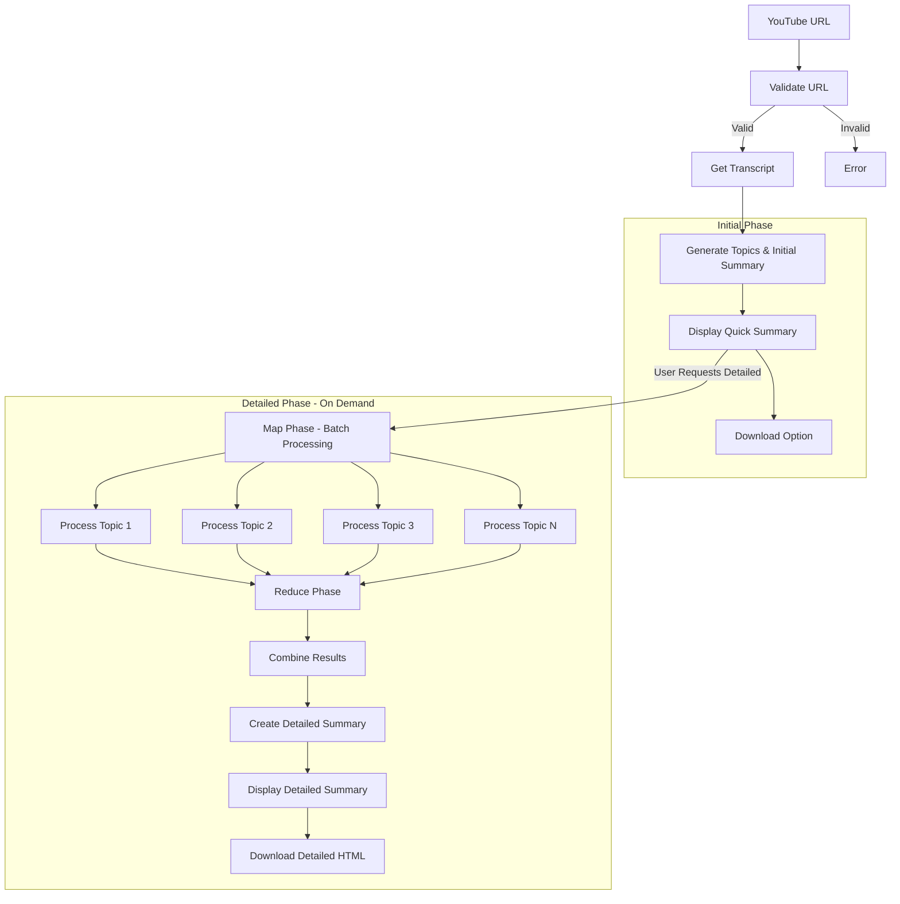

# YouTube Summarizer for Kids - Chrome Extension

<div align="center">

🎬 **Create kid-friendly summaries of YouTube videos with Q&A pairs and simple explanations** 🎬

[](https://developer.chrome.com/docs/extensions/mv3/)
[](LICENSE)
[](README.md)

</div>

## 🌟 Overview

This Chrome Extension creates child-friendly summaries of YouTube videos, making complex content accessible to children aged 3-12. Built following the **PocketFlow design system** with a **Map-Reduce architecture** for efficient topic processing.

### ✨ Key Features

- 🎯 **Two-Phase Summarization**: Quick initial summaries followed by detailed analysis
- ❓ **Interactive Q&A**: Generates engaging question-answer pairs for each topic
- 📥 **Download Summaries**: Save beautiful HTML files with complete summaries and proper video links
- 🔄 **Collapsible Sections**: Interactive expandable content for better organization
- 🎨 **Beautiful Design**: Colorful, engaging interface designed specifically for children
- 🔧 **Age Customization**: Adjustable content complexity for different age groups (3-5, 6-8, 9-12 years)
- 📝 **Rich Text Formatting**: Proper bullet points, bold text, and structured content in summaries and downloads
- 🌙 **Dark Mode Support**: Automatic adaptation to YouTube's dark theme
- ♿ **Accessibility Features**: High contrast, responsive design, and keyboard navigation
- 🚀 **Manifest V3**: Modern, secure Chrome Extension architecture
- 🤖 **AI-Powered**: Uses Google's Gemini 2.0 Flash for intelligent content processing
- 🎛️ **Auto-Save Settings**: Settings automatically save as you change them (no manual save required)
- 👁️ **Smart Auto-Detect**: Configurable auto-detection of new videos with instant on/off toggle

## 🏗️ Architecture

This extension implements the **PocketFlow design pattern** with a **Map-Reduce approach**:

### Flow Design (Based on PocketFlow Principles)



### Node Implementation

Following PocketFlow's node-based architecture with two-phase processing:

**Phase 1 - Initial Summary (Fast):**
1. **ValidateURL Node**: Validates YouTube URLs
2. **GetTranscript Node**: Extracts video transcripts and metadata
3. **GenerateTopics Node**: Identifies main topics and creates initial summary
4. **DisplayInitial Node**: Shows quick summary with topic overview

**Phase 2 - Detailed Analysis (On Demand):**
5. **TopicProcessor BatchNode**: Processes each topic independently (Map phase)
6. **CombineTopics Node**: Combines and refines results (Reduce phase)
7. **CreateDetailedSummary Node**: Generates comprehensive summary
8. **DownloadManager Node**: Creates formatted HTML files for download

## 🚀 Installation

### Prerequisites

1. **Google Chrome** browser (or Chromium-based browser)
2. **Gemini API Key** from [Google AI Studio](https://makersuite.google.com/app/apikey)

### Development Installation

1. **Clone/Download** this repository:
   ```bash
   git clone https://github.com/adityasoni99/YoutubeSummarizerKidsExtension.git
   cd youtube-summarizer-extension
   ```

2. **Add Extension Icons**: 
   - Create or add PNG icon files in the `images/` folder
   - Required sizes: 16x16, 32x32, 48x48, 128x128 pixels
   - See `images/README.md` for design guidelines

3. **Load Extension in Chrome**:
   - Open Chrome and navigate to `chrome://extensions/`
   - Enable "Developer mode" (toggle in top right)
   - Click "Load unpacked"
   - Select the `youtube-summarizer-extension` folder

4. **Configure API Key**:
   - Click the extension icon in Chrome toolbar
   - Click "Settings" or right-click extension → "Options"
   - Enter your Gemini API key (auto-saves as you type)
   - Test API key with built-in validator
   - Adjust other settings as needed (all auto-save)

### Production Installation

*Once published to Chrome Web Store:*

1. Visit the Chrome Web Store listing
2. Click "Add to Chrome"
3. Configure your Gemini API key in extension options

## 🎮 Usage

### Basic Usage

1. **Navigate** to any YouTube video
2. **Look for** the "🎬 Kid-Friendly Summary" button (appears automatically)
3. **Click** "Create Kid-Friendly Summary" for quick overview
4. **View** the initial summary with main topics
5. **Download** the quick summary as HTML (optional)
6. **Click** "View Detailed Summary" for in-depth analysis
7. **Explore** interactive collapsible sections with Q&A
8. **Download** the detailed summary as formatted HTML

### Two-Phase Approach

#### 📊 **Quick Summary (Phase 1)**
- Fast initial analysis (5-10 seconds)
- Main topic identification
- Brief overview suitable for quick reading
- Downloadable as "Quick Summary" HTML

#### 🔍 **Detailed Summary (Phase 2)**
- Comprehensive analysis (15-30 seconds)
- Detailed explanations for each topic
- Interactive Q&A sections
- Collapsible content organization
- Downloadable as "Detailed Summary" HTML

### Advanced Features

#### Interactive Content
- **Collapsible Sections**: Click to expand/collapse detailed explanations
- **Q&A Pairs**: Engaging questions with simple answers
- **Rich Formatting**: Bullet points, bold text, and structured content
- **Dark Mode**: Automatic adaptation to YouTube's theme

#### Smart Auto-Detection
- **Auto-detect Videos**: Automatically shows summary button when you navigate to new videos
- **Instant Toggle**: Enable/disable auto-detection from extension settings
- **Real-time Updates**: Settings changes apply immediately without page refresh
- **Popup Access**: Always access summaries through extension popup, even with auto-detect disabled

#### Download Options
- **Quick Summary**: Lightweight HTML with main topics
- **Detailed Summary**: Complete interactive HTML with all content
- **Proper Video Links**: Downloaded files link back to original YouTube video (not local file)
- **Rich Text Formatting**: Downloaded summaries include bullet points, bold text, and proper structure
- **Print-Ready**: Optimized for printing and sharing

#### Modern Settings Experience
- **Auto-Save**: Settings automatically save as you change them (no manual save button needed)
- **Real-time Feedback**: See "Auto-saving..." and "Saved" notifications
- **Smart Validation**: API key testing and validation built-in
- **Import/Export**: Backup and restore your settings

#### Age Customization
- **3-5 years**: Very simple words and basic concepts
- **6-8 years**: Elementary school level explanations  
- **9-12 years**: More detailed but still kid-friendly content

## ⚙️ Configuration

### API Key Setup

1. **Get API Key**:
   - Visit [Google AI Studio](https://makersuite.google.com/app/apikey)
   - Sign in with Google account
   - Create a new API key (Gemini 2.0 Flash recommended)
   - Copy the key securely

2. **Configure Extension**:
   - Open extension options page
   - Paste API key in the designated field (auto-saves)
   - Test the connection with built-in validator
   - Adjust summary settings (auto-save enabled)

### Settings Options

| Setting | Description | Default | Status |
|---------|-------------|---------|---------|
| Default Age Group | Target age for content adaptation | 6-8 years | ✅ Implemented |
| API Key | Gemini 2.0 Flash API authentication | None | ✅ Implemented |
| Summary Length | Controls how detailed summaries are (short/medium/long) | Medium | ✅ Implemented |
| Max Topics | Number of main topics to identify per video | 5 topics | ✅ Implemented |
| Auto-detect Videos | Automatically show summary button on new videos | Enabled | ✅ Implemented |
| Auto-Save Settings | Settings save automatically as you change them | Always On | ✅ Implemented |
| Content Safety | Child-safe filtering level | Strict | ✅ Implemented |
| Download Format | HTML export with proper video links and formatting | Professional | ✅ Implemented |
| Display Theme | Light/Dark mode preference | Auto (follows YouTube) | ✅ Implemented |

### Advanced Configuration

- **Two-Phase Processing**: Quick initial + detailed follow-up summaries
- **Interactive Features**: Collapsible sections and Q&A formatting
- **Download Options**: Separate HTML exports for quick and detailed summaries
- **Dark Mode Support**: Automatic theme adaptation
- **Rich Text Formatting**: Bullet points, bold text, and structured content

### Access Options Page
1. Click the extension icon in your browser toolbar
2. Click the "⚙️" gear icon in the popup
3. Or right-click the extension icon → "Options"

## 🏛️ Project Structure

```
youtube-summarizer-extension/
├── manifest.json              # Extension manifest (V3)
├── popup.html                 # Extension popup interface
├── options.html               # Settings/options page
├── test-extension.html        # Manual testing interface
├── test-page.html             # Testing helper page
├── step-by-step-test.html     # Step-by-step testing guide
├── js/
│   ├── background.js          # Service worker (main logic + downloads)
│   ├── content.js             # YouTube integration + navigation
│   ├── popup.js               # Popup interface logic
│   └── options.js             # Settings page logic
├── css/
│   ├── popup.css              # Popup styling (dark mode support)
│   ├── options.css            # Settings page styling
│   └── content.css            # YouTube injection styles + formatting
├── images/
│   ├── icon16.png             # Extension icons (various sizes)
│   ├── icon32.png
│   ├── icon48.png
│   ├── icon128.png
│   └── README.md              # Icon requirements
├── tests/                     # Testing framework (structure prepared)
│   ├── unit/                  # Unit tests (to be implemented)
│   ├── integration/           # Integration tests (to be implemented)
│   └── e2e/                   # End-to-end tests (to be implemented)
├── design.md                  # Design specifications
├── current_design.md          # Current implementation status
├── TESTING.md                 # Testing procedures
├── TEST-EXTENSION.md          # Extension testing guide
├── INSTALLATION.md            # Installation guide
└── README.md                  # This documentation
```

### Key Components

#### `background.js` - Core Logic
- **SummaryGenerator**: Handles Gemini API communication
- **SummaryDownloadManager**: Creates formatted HTML downloads with proper video links
- **Two-phase processing**: Quick summaries + detailed analysis
- **Text formatting**: Converts plain text to rich HTML with bullet points and bold text
- **URL handling**: Ensures downloaded files link to YouTube videos, not local files

#### `content.js` - YouTube Integration  
- **Video detection**: Automatic button injection on YouTube pages
- **Smart auto-detection**: Configurable auto-show summary button with real-time settings sync
- **Navigation handling**: SPA navigation with `observeVideoChanges()` and proper cleanup
- **Summary display**: Interactive panels with collapsible sections
- **Settings integration**: Real-time response to auto-detect setting changes

#### `content.css` - Styling System
- **Dark mode support**: Automatic theme adaptation
- **Rich text formatting**: Bullet points, bold text, proper spacing
- **Responsive design**: Mobile and desktop compatibility
- **Accessibility**: High contrast and readable fonts

## 🔌 API Integration

### Gemini API Usage

The extension uses Google's Gemini 1.5 Flash model for:

- **Topic Extraction**: Analyzing video transcripts to identify main themes
- **Content Simplification**: Converting complex concepts to child-friendly language
- **Q&A Generation**: Creating engaging questions and answers
- **Summary Creation**: Producing cohesive overall summaries

### API Endpoints

- **Model**: `gemini-1.5-flash-latest`
- **Endpoint**: `https://generativelanguage.googleapis.com/v1beta/models/gemini-1.5-flash-latest:generateContent`
- **Authentication**: API Key in `x-goog-api-key` header

### Rate Limits & Costs

- Check [Google AI Pricing](https://ai.google.dev/pricing) for current rates
- Extension includes intelligent retry logic for rate limiting
- API usage is optimized through structured prompts

## 🛠️ Development

### Technology Stack

- **Frontend**: HTML5, CSS3, Vanilla JavaScript
- **Extension API**: Chrome Extension Manifest V3
- **AI/ML**: Google Gemini API
- **Architecture**: PocketFlow-inspired design patterns
- **Storage**: Chrome Storage Sync API

### Code Organization

Following **PocketFlow principles**:

1. **Node-based Architecture**: Each processing step is a discrete node
2. **Shared Store Pattern**: Data flows through a shared state object
3. **Map-Reduce Implementation**: Parallel topic processing with result aggregation
4. **Clean Separation**: UI, logic, and data processing are separated

### Key Components

#### Background Service Worker (`background.js`)
- Implements the main summarization flow
- Handles Gemini API communications
- Manages data processing pipeline

#### Content Script (`content.js`)
- Integrates with YouTube pages
- Extracts video information and transcripts
- Displays summary results

#### Popup Interface (`popup.js`)
- Provides quick access controls
- Shows current video status
- Handles user preferences

#### Options Page (`options.js`)
- Comprehensive settings management
- API key configuration and testing
- Accessibility and customization options

### Adding New Features

1. **Follow PocketFlow Patterns**: Implement new features as nodes
2. **Update Manifest**: Add any new permissions needed
3. **Test Thoroughly**: Ensure compatibility across Chrome versions
4. **Document Changes**: Update README and inline comments

## 🧪 Testing

### Manual Testing

The extension includes comprehensive manual testing procedures:

1. **Basic Functionality**:
   - Use `test-extension.html` for guided testing interface
   - Use `step-by-step-test.html` for comprehensive testing procedures
   - Test on various YouTube videos
   - Try different age group settings
   - Verify summary quality and appropriateness

2. **Error Handling**:
   - Test with videos without captions
   - Try invalid API keys
   - Test network connectivity issues

3. **UI/UX Testing**:
   - Check responsive design
   - Test accessibility features
   - Verify color contrast and readability

### Automated Testing

The extension now includes a comprehensive automated testing framework:

#### **Test Coverage**
- **Unit Tests**: 70+ test cases covering core functions, DOM manipulation, settings management
- **Integration Tests**: 20+ test cases for Chrome APIs and external service integration
- **End-to-End Tests**: 15+ test cases for complete user workflows using Puppeteer

#### **Running Tests**
```bash
# Install dependencies
npm install

# Run all tests
npm test

# Run specific test types
npm run test:unit           # Unit tests only
npm run test:integration    # Integration tests only
npm run test:e2e           # End-to-end tests only

# Development and coverage
npm run test:watch         # Watch mode
npm run test:coverage      # Generate coverage report
```

#### **Test Structure**
- **`tests/unit/`**: Core function testing (background.js, content.js, popup.js)
- **`tests/integration/`**: Chrome API and Gemini API integration testing
- **`tests/e2e/`**: Full browser workflow testing with Puppeteer
- **`tests/utils/`**: Reusable test utilities and mock data factories

#### **Coverage Thresholds**
- Branches: 70%
- Functions: 70% 
- Lines: 70%
- Statements: 70%

See `tests/README.md` for detailed testing documentation.

## 🚢 Deployment

### Chrome Web Store Submission

1. **Prepare Assets**:
   - High-quality icons (128x128 for store)
   - Screenshots of extension in action
   - Promotional graphics (440x280, 920x680, 1400x560)

2. **Package Extension**:
   ```bash
   # Create zip file excluding development files
   zip -r extension.zip . -x "*.git*" "*node_modules*" "*.md" "tests/*"
   ```

3. **Submit to Store**:
   - Visit [Chrome Web Store Developer Dashboard](https://chrome.google.com/webstore/devconsole/)
   - Upload zip file
   - Fill out store listing details
   - Submit for review

### Version Management

- Follow semantic versioning (e.g., 1.0.0)
- Update `manifest.json` version before each release
- Maintain changelog of updates

## 🔒 Security & Privacy

### Data Handling

- **No Data Storage**: Extension doesn't store video content
- **API Key Security**: Keys stored locally using Chrome's secure storage
- **Minimal Permissions**: Only requests necessary permissions
- **No Tracking**: No user behavior tracking or analytics

### Privacy Policy

The extension:
- ✅ Only processes video content when explicitly requested
- ✅ Uses secure HTTPS connections for all API calls
- ✅ Stores preferences locally on user's device
- ❌ Does not collect or share personal information
- ❌ Does not track browsing history or behavior

### Security Best Practices

- Input validation for all user data
- Secure API key storage and transmission
- Content Security Policy (CSP) compliance
- Regular security audits and updates

## 🤝 Contributing

We welcome contributions! Please see our contributing guidelines:

### Development Setup

1. Fork the repository
2. Create a feature branch: `git checkout -b feature-name`
3. Make changes following our coding standards
4. Test thoroughly
5. Submit a pull request

### Coding Standards

- Use semantic variable and function names
- Comment complex logic clearly
- Follow existing code style and formatting
- Write JSDoc comments for public functions

### Areas for Contribution

- 🎨 **UI/UX Improvements**: Better visual design and user experience
- 🌍 **Internationalization**: Complete multilingual support implementation
- ♿ **Accessibility Enhancements**: Full large fonts, high contrast, and text-to-speech
- 🚀 **Performance**: Optimize API usage and processing speed
- 🧪 **Testing**: Comprehensive automated testing framework with unit, integration, and E2E tests
- 📚 **Documentation**: Improve documentation and tutorials

### 🔮 Future Scope

The following features are partially implemented or planned for future releases:

#### 🌍 **Multilingual Support** (Partial Implementation)
- **Current**: UI has language selection dropdown in options
- **Missing**: Backend integration with Gemini API for non-English summaries
- **Plan**: Complete implementation of multi-language prompt generation

#### ♿ **Advanced Accessibility Features** (Partial Implementation)
- **Current**: Basic options UI in settings page
- **Missing**: Integration with main extension interface
- **Planned Features**:
  - Large fonts throughout extension panels
  - High contrast mode for better visibility
  - Text-to-speech integration for audio summaries
  - Keyboard navigation enhancements

#### 📱 **Mobile Optimization**
- Responsive design improvements for mobile browsers
- Touch-friendly interface elements
- Optimized layout for smaller screens

#### 🔊 **Audio Features**
- Text-to-speech for generated summaries
- Audio speed controls
- Voice selection options

#### 🎯 **Enhanced Targeting**
- More granular age group settings
- Learning difficulty adjustments
- Special needs accommodations

## 📄 License

This project is licensed under the MIT License - see the [LICENSE](LICENSE) file for details.

## 🙏 Acknowledgments

- **Google Gemini**: AI capabilities for content processing
- **Chrome Extensions Team**: Excellent documentation and tools
- **Open Source Community**: Libraries and resources that made this possible

## 📞 Support

### Getting Help

- 📖 **Documentation**: Check this README and inline comments
- 🐛 **Issues**: [Report bugs](https://github.com/adityasoni99/YoutubeSummarizerKidsExtension/issues) on GitHub
- 💡 **Feature Requests**: [Suggest improvements](https://github.com/adityasoni99/YoutubeSummarizerKidsExtension/issues) 
- 📧 **Contact**: [Your contact information]

### Common Issues

#### "API Key not configured"
- Ensure you've entered a valid Gemini API key in extension options
- Test the API key using the "Test API Key" button
- Make sure you're using Gemini 2.0 Flash for best results

#### "Could not extract transcript"
- Video may not have captions/subtitles available
- Try a different video with auto-generated captions
- Some videos may have restricted access to transcripts

#### "Extension not working on YouTube"
- Refresh the YouTube page after installation
- Check if extension is enabled in chrome://extensions/
- Look for the "🎬 Kid-Friendly Summary" button near video title
- Try navigating to a different video if button doesn't appear

#### "Download not working"
- Ensure pop-ups are allowed for YouTube domain
- Check browser's download settings
- Try downloading after summary generation completes
- Some browsers may block automatic downloads

#### "Formatting issues in downloaded files"
- Make sure to use a modern browser (Chrome 90+, Firefox 88+)
- Check that HTML files open in a browser, not text editor
- Verify the download completed fully (check file size)

#### "Quick vs Detailed summaries not working"
- Allow Phase 1 to complete before requesting detailed analysis
- Each phase may take 5-30 seconds depending on video length
- Check console for any API rate limiting messages

### Troubleshooting

1. **Check Extension Status**: Ensure extension is enabled and loaded
2. **Verify API Key**: Test API connectivity in options page  
3. **Console Logs**: Check browser console (F12) for error messages
4. **Clear Storage**: Reset extension data in chrome://extensions/
5. **Reinstall**: Try removing and reinstalling the extension
6. **Test Video**: Try with a known working video (educational content)
7. **Check Permissions**: Verify extension has YouTube access permissions

### Performance Tips

- **API Usage**: 
  - **Quick Summary**: 1 API call per video
  - **Detailed Summary**: N+1 additional API calls (where N = number of topics identified, typically 3-6)
  - **Total per video**: 1 + (N+1) = 2-7 API calls depending on topic count
- **Cache**: Summaries are cached per video to avoid re-processing
- **Navigation**: Extension detects YouTube SPA navigation automatically
- **Background Processing**: Summaries generate while you continue browsing

---

<div align="center">

**Made with ❤️ for kids and parents everywhere**

[🌟 Star this project](https://github.com/adityasoni99/YoutubeSummarizerKidsExtension) • [🐛 Report Bug](https://github.com/adityasoni99/YoutubeSummarizerKidsExtension/issues) • [💡 Request Feature](https://github.com/adityasoni99/YoutubeSummarizerKidsExtension/issues)

</div>
