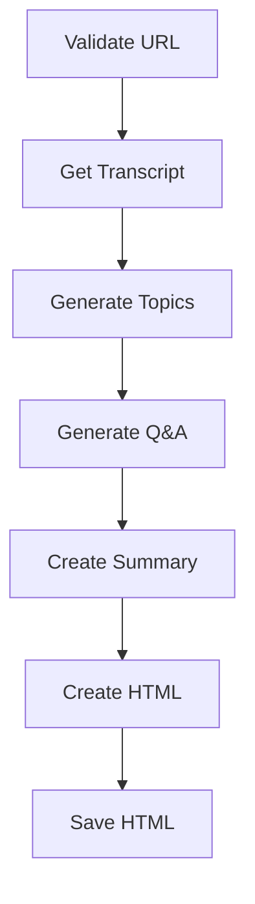
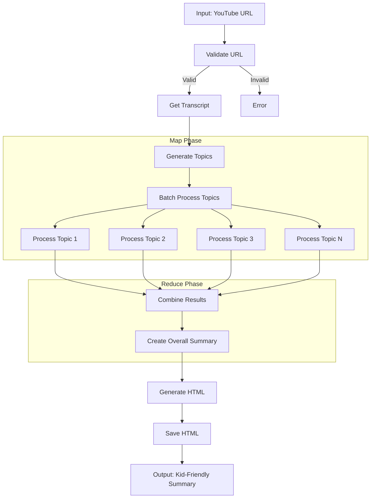

# Design Doc: YouTube Video Summarizer

> Please DON'T remove notes for AI

## Requirements

> Notes for AI: Keep it simple and clear.
> If the req### Node Steps

> Notes for AI: Carefully decide whether to use Batch/Async Node/Flow.

1. **ValidateURL Node**
   - *Purpose*: Validates that the input is a proper YouTube URL
   - *Type*: Regular
   - *Steps*:
     - *prep*: Read "youtube_url" from the shared store
     - *exec*: Call the URL validator utility function
     - *post*: If valid, continue to next node; if invalid, return error action

2. **GetTranscript Node**
   - *Purpose*: Retrieves the transcript and metadata for the YouTube video
   - *Type*: Regular (consider Async for long videos)
   - *Steps*:
     - *prep*: Read "youtube_url" from the shared store
     - *exec*: Call the get_transcript utility function
     - *post*: Write "transcript" and "video_info" to the shared store

3. **GenerateTopics Node**
   - *Purpose*: Identifies main topics from the transcript
   - *Type*: Regular
   - *Steps*:
     - *prep*: Read "transcript" from the shared store
     - *exec*: Call LLM to identify and extract main topics
     - *post*: Write initial "topics" list (with name and content) to shared store

4. **TopicProcessor BatchNode**
   - *Purpose*: Map phase - Processes each topic independently 
   - *Type*: BatchNode (implements the Map part of MapReduce)
   - *Steps*:
     - *prep*: Read "topics" from the shared store and return as iterable
     - *exec*: For each topic, call LLM to generate Q&A pairs, child-friendly explanation, and summary
     - *post*: Collect all processed topics and write updated topics with all details to shared store

5. **CombineTopics Node**
   - *Purpose*: Reduce phase - Combines results from all topic processing
   - *Type*: Regular (implements the Reduce part of MapReduce)
   - *Steps*:
     - *prep*: Read processed "topics" from the shared store
     - *exec*: Call LLM to generate cohesive connections between topics and ensure consistent style
     - *post*: Write "processed_topics" to the shared store

6. **CreateSummary Node**
   - *Purpose*: Creates an overall summary of the video in child-friendly language
   - *Type*: Regular
   - *Steps*:
     - *prep*: Read "transcript" and "processed_topics" from the shared store
     - *exec*: Call LLM to generate simple overall summary
     - *post*: Write "summary" to the shared store

7. **CreateHTML Node**
   - *Purpose*: Generates HTML content from the processed data
   - *Type*: Regular
   - *Steps*:
     - *prep*: Read "video_info", "processed_topics", and "summary" from the shared store
     - *exec*: Call the generate_html utility function
     - *post*: Write "html_content" to the shared store

8. **SaveHTML Node**
   - *Purpose*: Saves the HTML content to a file
   - *Type*: Regular
   - *Steps*:
     - *prep*: Read "html_content" and "video_info" from the shared store
     - *exec*: Call the save_html utility function
     - *post*: Write "output_path" to the shared store

## Shared Store Design

> Notes for AI: Design a shared data structure.

The shared store will contain:

```python
shared = {
    # Input
    "youtube_url": "https://www.youtube.com/watch?v=...",
    
    # Transcript data
    "transcript": "Full text of the video transcript...",
    "video_info": {
        "title": "Video Title",
        "duration": 600,  # in seconds
        "thumbnail_url": "https://..."
    },
    
    # Map phase - Extracted topics
    "topics": [
        {
            "id": 1,
            "name": "Topic Title",
            "content": "Content from transcript related to this topic..."
        },
        # More topics...
    ],
    
    # Reduce phase - Processed topics with Q&A and explanations
    "processed_topics": [
        {
            "id": 1,
            "name": "Topic Title",
            "content": "Content from transcript...",
            "summary": "Child-friendly summary...",
            "explanation": "Detailed explanation in simple terms...",
            "qa_pairs": [
                {"question": "Question 1?", "answer": "Answer 1"},
                {"question": "Question 2?", "answer": "Answer 2"},
                # More Q&A pairs...
            ]
        },
        # More processed topics...
    ],
    
    # Output
    "summary": "Overall child-friendly summary of the video...",
    "html_content": "<!DOCTYPE html>...",
    "output_path": "/path/to/output.html",
    
    # Error handling
    "error": "Error message if something goes wrong"
}

### Applicable Design Pattern:

The YouTube Video Summarizer will primarily use a **Workflow** design pattern, with elements of **Map-Reduce**:

1. **Workflow**: The overall process follows a sequential workflow of getting the transcript, processing content, and generating output.
2. **Map-Reduce**: For topic extraction and Q&A generation, we'll map the transcript into logical segments (topics), then reduce each segment into a summary with corresponding Q&A pairs.

### Flow high-level Design:

1. **ValidateURL Node**: Validates the YouTube URL input and ensures it's a proper YouTube video link.
2. **GetTranscript Node**: Retrieves the transcript and video metadata from the YouTube URL.
3. **GenerateTopics Node**: Analyzes the transcript and identifies the main topics covered in the video.
4. **GenerateQA Node**: For each identified topic, generates child-friendly questions and answers (implements Map pattern).
5. **CreateSummary Node**: Creates an overall summary of the video in child-friendly language.
6. **CreateHTML Node**: Combines all the generated content into an HTML page.
7. **SaveHTML Node**: Saves the HTML content to a file for the user to access.


## Utility Functions

> Notes for AI:
> 1. Understand the utility function definition thoroughly by reviewing the doc.
> 2. Include only the necessary utility functions, based on nodes in the flow.

1. **Call LLM** (`utils/call_llm.py`)
   - *Input*: prompt (str)
   - *Output*: response (str)
   - *Necessity*: Used by most nodes for generating summaries, topics, and Q&A

2. **YouTube Transcript** (`utils/get_transcript.py`)
   - *Input*: youtube_url (str)
   - *Output*: transcript_info (dict) containing:
     - transcript (str): Full transcript text
     - title (str): Video title
     - duration (int): Video duration in seconds
     - thumbnail_url (str): URL to video thumbnail
   - *Necessity*: Used to directly get the transcript of a YouTube video without audio processing

3. **HTML Generator** (`utils/generate_html.py`)
   - *Input*: 
     - title (str)
     - topics (list of dict)
     - summary (str)
     - thumbnail_url (str)
   - *Output*: html_content (str)
   - *Necessity*: Used to create the HTML visualization content

4. **HTML Saver** (`utils/save_html.py`)
   - *Input*:
     - html_content (str)
     - filename (str)
   - *Output*: file_path (str): Path where the HTML file was saved
   - *Necessity*: Used to save the generated HTML content to a file

5. **URL Validator** (`utils/validate_url.py`)
   - *Input*: url (str)
   - *Output*: is_valid (bool), error_message (str) if invalid
   - *Necessity*: Used to validate YouTube URLs before processing

## Node Design

### Shared Store

> Notes for AI: Try to minimize data redundancy

The shared store structure is organized as follows:

```python
shared = {
    "youtube_url": "https://www.youtube.com/watch?v=...",  # Input URL
    "video_info": {  # Metadata about the video
        "title": "Video Title",
        "duration": 600,  # in seconds
        "thumbnail_url": "https://example.com/thumbnail.jpg"
    },
    "transcript": "Full transcript text of the video...",  # Raw transcript
    "topics": [  # List of identified topics
        {
            "name": "Topic Name",
            "content": "Relevant transcript section for this topic",
            "summary": "Child-friendly summary of this topic",
            "qa": [  # Q&A pairs for this topic
                {
                    "question": "Question about the topic?",
                    "answer": "Simple answer for a 5-year-old"
                },
                # More Q&A pairs...
            ]
        },
        # More topics...
    ],
    "summary": "Overall child-friendly summary of the video",
    "html_content": "<html>...</html>",  # Generated HTML content
    "output_path": "/path/to/saved/file.html"  # Path where HTML is saved
}
```

### Node Steps

> Notes for AI: Carefully decide whether to use Batch/Async Node/Flow.

1. First Node
  - *Purpose*: Provide a short explanation of the node’s function
  - *Type*: Decide between Regular, Batch, or Async
  - *Steps*:
    - *prep*: Read "key" from the shared store
    - *exec*: Call the utility function
    - *post*: Write "key" to the shared store

2. Second Node
  ...

## Flow Design

> Notes for AI:
> 1. Consider the design patterns of agent, map-reduce, rag, and workflow. Apply them if they fit.
> 2. Present a concise, high-level description of the workflow.

### Map Reduce Pattern for Topic Processing

We'll implement a Map Reduce pattern to efficiently process topics extracted from the video transcript:

1. **Map Phase**: Process each topic independently in parallel to generate Q&A pairs and explanations
2. **Reduce Phase**: Combine the results into a cohesive summary and presentation



This design allows us to:
- Process each topic independently
- Scale efficiently with the number of topics
- Maintain a consistent structure for all topic summaries and Q&A pairs

## Map Reduce Implementation

> Notes for AI: Explain the Map Reduce pattern implementation details.

The Map Reduce pattern is implemented as follows:

### Map Phase (TopicProcessor BatchNode)

1. **Input**: List of topics extracted from the transcript
2. **Processing**:
   - The BatchNode's `prep()` method returns the topics list as an iterable
   - For each topic, the `exec()` method:
     - Processes the topic independently
     - Generates child-friendly explanations
     - Creates Q&A pairs
     - Produces a summary
3. **Output**: Each topic is processed independently, potentially in parallel

### Reduce Phase (CombineTopics Node)

1. **Input**: All individually processed topics
2. **Processing**:
   - The `exec()` method:
     - Ensures consistency across all topic explanations
     - Creates transitions between topics
     - Standardizes the level of simplification
     - Ranks topics by importance
3. **Output**: A unified set of processed topics with consistent style and quality

### Benefits of this Approach

1. **Parallelization**: Each topic can be processed independently, improving performance
2. **Consistency**: The reduce phase ensures a unified style across all topics
3. **Scalability**: Can handle videos with many topics without performance degradation
4. **Fault Tolerance**: If processing one topic fails, others can still succeed

This pattern is particularly well-suited for our use case because:
- Topics are naturally independent units
- Each topic requires significant LLM processing
- The final output needs to maintain a consistent style and complexity level
- We want to ensure all explanations are equally child-friendly
