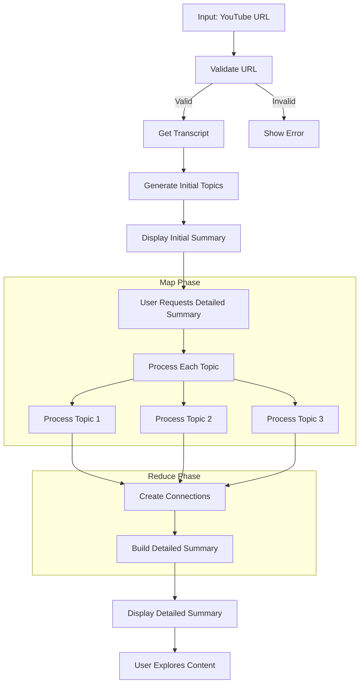

# Design Doc: YouTube Video Summarizer for Kids Chrome Extension

> Please DON'T remove notes for AI

## Architecture Overview

The YouTube Video Summarizer for Kids is implemented as a Chrome extension with a two-phase summarization approach:

1. **Initial Phase**: Generates a quick, lightweight summary with main topics
2. **Detailed Phase**: Provides comprehensive content with Q&A, explanations, and connections between topics

### Extension Components

1. **Background Service Worker** (`background.js`): 
   - Implements the main summarization workflow
   - Handles communication between components
   - Processes API calls to Gemini

2. **Content Script** (`content.js`):
   - Extracts video information and transcript
   - Injects and manages UI elements on YouTube pages
   - Observes navigation between videos

3. **Popup & Options** (`popup.js`, `options.js`): 
   - User interfaces for quick actions and configuration
   - API key management
   - Settings control

4. **CSS Styling** (`content.css`, etc.):
   - Kid-friendly UI with consistent styling
   - Responsive design for different screen sizes
   - Accessibility features and dark mode support

## Implementation Design

The YouTube Video Summarizer follows a **Workflow** design pattern with elements of **Map-Reduce** and implements a **two-phase processing approach**:

1. **Initial Phase** (Fast, Lightweight):
   - Extract transcript and basic video information
   - Generate main topics and brief descriptions
   - Create a simple overall summary
   - Display results immediately to the user

2. **Detailed Phase** (On-Demand, Comprehensive):
   - Process each topic independently in-depth (Map)
   - Generate Q&A pairs, explanations, and detailed content
   - Create connections between topics (Reduce)
   - Display comprehensive summary with collapsible sections

## Requirements

> Notes for AI: Keep it simple and clear.
> If the req### Node Steps

> Notes for AI: Carefully decide whether to use Batch/Async Node/Flow.

### Phase 1: Initial Summarization

1. **ValidateURL Node**
   - *Purpose*: Validates that the input is a proper YouTube URL
   - *Type*: Regular
   - *Implementation*: Uses a regex pattern to validate the URL and extract the video ID
   - *Steps*:
     - Read URL from the request
     - Validate with regex pattern for YouTube watch URLs
     - Extract and store the video ID
     - Return validation result

2. **GetTranscript Node**
   - *Purpose*: Retrieves the transcript and metadata for the YouTube video
   - *Type*: Async (communicates with content script)
   - *Implementation*: Sends message to content script to extract information from the webpage
   - *Steps*:
     - Send message to content script requesting video information
     - Implement retry logic for reliable extraction
     - Validate received transcript content
     - Store transcript and video metadata

3. **GenerateTopics Node**
   - *Purpose*: Identifies main topics and creates an initial summary
   - *Type*: Regular (calls external API)
   - *Implementation*: Uses Gemini API to analyze transcript and identify topics
   - *Steps*:
     - Prepare prompt with video title and transcript
     - Call Gemini API to identify topics and generate initial summary
     - Parse and validate the response
     - Store topics and initial summary

4. **ReturnInitialResults Node**
   - *Purpose*: Returns the initial phase results to the user interface
   - *Type*: Regular
   - *Implementation*: Formats data for the content script to display
   - *Steps*:
     - Collect video info, topics, and initial summary
     - Format response with processing state marked as "initial"
     - Return data to content script for display

### Phase 2: Detailed Summarization (On-Demand)

5. **ProcessTopics Node** (Map Phase)
   - *Purpose*: Processes each topic in-depth with explanations and Q&A
   - *Type*: BatchNode (conceptually processes each topic independently)
   - *Implementation*: Uses Gemini API to create detailed content for each topic
   - *Steps*:
     - For each topic, generate a comprehensive prompt
     - Call Gemini API to generate Q&A pairs and explanations
     - Parse and structure the responses
     - Store processed topics with all details

6. **CombineTopics Node** (Reduce Phase)
   - *Purpose*: Creates connections between topics and ensures consistency
   - *Type*: Regular
   - *Implementation*: Uses Gemini API to find relationships between topics
   - *Steps*:
     - Prepare prompt with all processed topics
     - Call Gemini API to generate connections and relationships
     - Parse response to extract connection statements
     - Store topic connections and ranking

7. **CreateDetailedSummary Node**
   - *Purpose*: Creates a comprehensive summary of the entire video
   - *Type*: Regular
   - *Implementation*: Uses Gemini API or composes from existing content
   - *Steps*:
     - Generate prompt with all available information
     - Call Gemini API to create cohesive summary
     - Store detailed summary

8. **ReturnDetailedResults Node**
   - *Purpose*: Returns the complete detailed results to the user interface
   - *Type*: Regular
   - *Implementation*: Formats all processed data for the content script
   - *Steps*:
     - Collect all detailed information (processed topics, connections, etc.)
     - Format response with processing state marked as "completed"
     - Return data to content script for display

## Shared Store Design

> Notes for AI: Design a shared data structure.

The shared store will contain:

```python
shared = {
    # Input
    "youtube_url": "https://www.youtube.com/watch?v=...",
    
    # Transcript data
    "transcript": "Full text of the video transcript...",
    "video_info": {
        "title": "Video Title",
        "duration": 600,  # in seconds
        "thumbnail_url": "https://..."
    },
    
    # Map phase - Extracted topics
    "topics": [
        {
            "id": 1,
            "name": "Topic Title",
            "content": "Content from transcript related to this topic..."
        },
        # More topics...
    ],
    
    # Reduce phase - Processed topics with Q&A and explanations
    "processed_topics": [
        {
            "id": 1,
            "name": "Topic Title",
            "content": "Content from transcript...",
            "summary": "Child-friendly summary...",
            "explanation": "Detailed explanation in simple terms...",
            "qa_pairs": [
                {"question": "Question 1?", "answer": "Answer 1"},
                {"question": "Question 2?", "answer": "Answer 2"},
                # More Q&A pairs...
            ]
        },
        # More processed topics...
    ],
    
    # Output
    "summary": "Overall child-friendly summary of the video...",
    "html_content": "<!DOCTYPE html>...",
    "output_path": "/path/to/output.html",
    
    # Error handling
    "error": "Error message if something goes wrong"
}

### Applicable Design Pattern:

The YouTube Video Summarizer will primarily use a **Workflow** design pattern, with elements of **Map-Reduce**:

1. **Workflow**: The overall process follows a sequential workflow of getting the transcript, processing content, and generating output.
2. **Map-Reduce**: For topic extraction and Q&A generation, we'll map the transcript into logical segments (topics), then reduce each segment into a summary with corresponding Q&A pairs.

### Flow high-level Design:

1. **ValidateURL Node**: Validates the YouTube URL input and ensures it's a proper YouTube video link.
2. **GetTranscript Node**: Retrieves the transcript and video metadata from the YouTube URL.
3. **GenerateTopics Node**: Analyzes the transcript and identifies the main topics covered in the video.
4. **GenerateQA Node**: For each identified topic, generates child-friendly questions and answers (implements Map pattern).
5. **CreateSummary Node**: Creates an overall summary of the video in child-friendly language.
6. **CreateHTML Node**: Combines all the generated content into an HTML page.
7. **SaveHTML Node**: Saves the HTML content to a file for the user to access.

```mermaid
flowchart TD
    start[User on YouTube Video] --> button[Click Summary Button]
    button --> validate[Validate URL]
    validate -->|Invalid| error[Show Error]
    validate -->|Valid| transcript[Get Transcript]
    
    transcript --> topics[Generate Topics]
    topics --> initial[Initial Summary]
    
    initial --> display1[Display Initial Results]
    display1 --> user[User Views Initial Summary]
    
    user --> detail[Click "View Detailed Summary"]
    detail --> map[Process Topics in Detail]
    
    subgraph "Phase 1: Initial Summary"
        validate
        transcript
        topics
        initial
        display1
    end
    
    subgraph "Phase 2: Detailed Summary (On-Demand)"
        detail
        map --> combine[Create Topic Connections]
        combine --> summary[Create Detailed Summary]
        summary --> display2[Display Detailed Results]
    end
    
    display2 --> end[User Explores Detailed Content]
```

This two-phase approach provides several advantages:

1. **Improved User Experience**:
   - Users get initial results quickly without waiting for comprehensive processing
   - Detailed content is generated only when requested, saving resources
   - The UI clearly guides users through the progression of information

2. **Resource Efficiency**:
   - API calls are minimized for users who only need basic information
   - Processing time and costs are reduced by only performing detailed analysis when needed
   - Browser memory usage is optimized by loading content in stages

3. **Better Information Architecture**:
   - Information is presented in progressive levels of detail
   - Content is organized logically with topics first, then details
   - Collapsible sections allow users to focus on specific areas of interest

## Two-Phase Processing Design

The YouTube Summarizer implements a two-phase processing approach that balances performance with content depth:

### Phase 1: Initial Summary (Fast & Efficient)

The initial phase focuses on quickly providing useful information to the user:

1. **Content**: 
   - Brief overall summary of the video
   - List of main topics with short descriptions
   - No detailed explanations or Q&A content

2. **Implementation**: 
   - Single LLM call to identify topics and generate summary
   - Minimal processing to ensure quick response
   - Results displayed immediately after processing

3. **User Experience**:
   - Summary button on YouTube video pages
   - Click generates and displays initial summary
   - "View Detailed Summary" button allows progression to Phase 2

### Phase 2: Detailed Summary (Comprehensive & In-Depth)

The detailed phase is triggered only when requested by the user:

1. **Content**:
   - Detailed explanations for each topic
   - Q&A pairs for each topic
   - Connections between topics
   - Comprehensive overall summary

2. **Implementation**:
   - Multiple LLM calls to process each topic in depth
   - Topic connections generated using the entire context
   - Results displayed in expandable/collapsible sections

3. **User Experience**:
   - Loading indicator during detailed processing
   - Collapsible sections for exploring different topics
   - Rich content with explanations tailored for children

### Benefits of Two-Phase Approach

1. **Performance Optimization**:
   - Initial results appear quickly (1-3 seconds)
   - Detailed processing (5-15 seconds) only happens when requested
   - API usage is optimized by avoiding unnecessary processing

2. **User Engagement**:
   - Progressive disclosure keeps the interface simple initially
   - Users can decide if they want more detailed information
   - Content organization matches natural learning progression

3. **Resource Efficiency**:
   - Reduces overall API costs by making fewer calls for users who only need basic information
   - Optimizes client-side performance by loading content in stages
   - Improves extension reliability by breaking processing into manageable steps

## Utility Functions

> Notes for AI:
> 1. Understand the utility function definition thoroughly by reviewing the doc.
> 2. Include only the necessary utility functions, based on nodes in the flow.

1. **Call LLM** (`utils/call_llm.py`)
   - *Input*: prompt (str)
   - *Output*: response (str)
   - *Necessity*: Used by most nodes for generating summaries, topics, and Q&A

2. **YouTube Transcript** (`utils/get_transcript.py`)
   - *Input*: youtube_url (str)
   - *Output*: transcript_info (dict) containing:
     - transcript (str): Full transcript text
     - title (str): Video title
     - duration (int): Video duration in seconds
     - thumbnail_url (str): URL to video thumbnail
   - *Necessity*: Used to directly get the transcript of a YouTube video without audio processing

3. **HTML Generator** (`utils/generate_html.py`)
   - *Input*: 
     - title (str)
     - topics (list of dict)
     - summary (str)
     - thumbnail_url (str)
   - *Output*: html_content (str)
   - *Necessity*: Used to create the HTML visualization content

4. **HTML Saver** (`utils/save_html.py`)
   - *Input*:
     - html_content (str)
     - filename (str)
   - *Output*: file_path (str): Path where the HTML file was saved
   - *Necessity*: Used to save the generated HTML content to a file

5. **URL Validator** (`utils/validate_url.py`)
   - *Input*: url (str)
   - *Output*: is_valid (bool), error_message (str) if invalid
   - *Necessity*: Used to validate YouTube URLs before processing

## Node Design

### Shared Store

> Notes for AI: Try to minimize data redundancy

The shared store structure is organized as follows:

```javascript
shared = {
    // Input data
    "videoId": "dQw4w9WgXcQ",
    "youtubeUrl": "https://www.youtube.com/watch?v=dQw4w9WgXcQ",
    
    // Video metadata
    "videoInfo": {
        "title": "Video Title",
        "duration": 600,  // in seconds
        "thumbnailUrl": "https://img.youtube.com/vi/dQw4w9WgXcQ/maxresdefault.jpg"
    },
    
    // Extracted content
    "transcript": "Full text of the video transcript...",
    
    // Phase 1: Initial processing results
    "topics": [
        {
            "id": 1,
            "name": "Topic Name",
            "content": "Brief description of what this topic covers"
        },
        // More topics...
    ],
    "initialSummary": "Short kid-friendly summary of the whole video",
    
    // Phase 2: Detailed processing results
    "processedTopics": [
        {
            "id": 1,
            "name": "Topic Name",
            "content": "Brief description...",
            "summary": "Kid-friendly summary of this topic",
            "explanation": "Detailed but simple explanation of the concept",
            "qaPairs": [
                {"question": "Question 1?", "answer": "Simple answer 1"},
                {"question": "Question 2?", "answer": "Simple answer 2"},
                // More Q&A pairs...
            ]
        },
        // More processed topics...
    ],
    "topicConnections": [
        "Topic 1 connects to Topic 2 because...",
        "Topics 3 and 4 are related through...",
        // More connections...
    ],
    "topicRanking": [2, 1, 3, 4],  // Topics ordered by importance
    "detailedSummary": "Comprehensive kid-friendly summary of the entire video"
}
```

### Node Steps

> Notes for AI: Carefully decide whether to use Batch/Async Node/Flow.

1. First Node
  - *Purpose*: Provide a short explanation of the node’s function
  - *Type*: Decide between Regular, Batch, or Async
  - *Steps*:
    - *prep*: Read "key" from the shared store
    - *exec*: Call the utility function
    - *post*: Write "key" to the shared store

2. Second Node
  ...

## Flow Design

> Notes for AI:
> 1. Consider the design patterns of agent, map-reduce, rag, and workflow. Apply them if they fit.
> 2. Present a concise, high-level description of the workflow.

### Map Reduce Pattern for Topic Processing

We'll implement a Map Reduce pattern to efficiently process topics extracted from the video transcript:

1. **Map Phase**: Process each topic independently in parallel to generate Q&A pairs and explanations
2. **Reduce Phase**: Combine the results into a cohesive summary and presentation



This improved Map-Reduce implementation:

1. **Delays the Map phase** until the user requests the detailed summary
2. **Processes topics independently** to generate explanations and Q&A content
3. **Uses a Reduce phase** to find connections between topics and ensure consistency
4. **Presents results in a progressive manner** with collapsible sections

This design allows us to:
- Process each topic independently
- Scale efficiently with the number of topics
- Maintain a consistent structure for all topic summaries and Q&A pairs

## Map Reduce Implementation

> Notes for AI: Explain the Map Reduce pattern implementation details.

The Map Reduce pattern is implemented as follows:

### Map Phase (TopicProcessor BatchNode)

1. **Input**: List of topics extracted from the transcript
2. **Processing**:
   - The BatchNode's `prep()` method returns the topics list as an iterable
   - For each topic, the `exec()` method:
     - Processes the topic independently
     - Generates child-friendly explanations
     - Creates Q&A pairs
     - Produces a summary
3. **Output**: Each topic is processed independently, potentially in parallel

### Reduce Phase (CombineTopics Node)

1. **Input**: All individually processed topics
2. **Processing**:
   - The `exec()` method:
     - Ensures consistency across all topic explanations
     - Creates transitions between topics
     - Standardizes the level of simplification
     - Ranks topics by importance
3. **Output**: A unified set of processed topics with consistent style and quality

### Benefits of this Approach

1. **Parallelization**: Each topic can be processed independently, improving performance
2. **Consistency**: The reduce phase ensures a unified style across all topics
3. **Scalability**: Can handle videos with many topics without performance degradation
4. **Fault Tolerance**: If processing one topic fails, others can still succeed

This pattern is particularly well-suited for our use case because:
- Topics are naturally independent units
- Each topic requires significant LLM processing
- The final output needs to maintain a consistent style and complexity level
- We want to ensure all explanations are equally child-friendly

## Chrome Extension Implementation

The YouTube Summarizer is implemented as a Chrome extension with these key components:

### Background Service Worker (`background.js`)

The background service worker implements the core summarization workflow:

1. **Message Handling**:
   - Listens for messages from content scripts and popup
   - Manages asynchronous processing and responses
   - Handles API key verification

2. **API Integration**:
   - Makes calls to Gemini API with appropriate prompts
   - Handles API errors and retries
   - Processes and structures API responses

3. **Workflow Management**:
   - Implements the two-phase processing flow
   - Manages shared state between different processing steps
   - Coordinates the Map-Reduce pattern for topic processing

### Content Script (`content.js`)

The content script interacts with YouTube pages:

1. **UI Integration**:
   - Injects the summary button into YouTube's interface
   - Creates and manages the summary panel
   - Implements collapsible sections and interactive elements

2. **Video Monitoring**:
   - Observes URL changes to detect navigation between videos
   - Extracts video metadata and transcript content
   - Manages the summary panel's lifecycle with page changes

3. **User Interaction**:
   - Handles click events for summary generation
   - Manages the transition between initial and detailed phases
   - Provides loading indicators and error messages

### Options Page (`options.html`, `options.js`)

The options page provides configuration capabilities:

1. **API Key Management**:
   - Allows users to enter and save their Gemini API key
   - Validates the API key format
   - Securely stores the key in Chrome's sync storage

2. **Preferences**:
   - Customization options for the extension's behavior
   - Settings for appearance and functionality
   - Help and support information

### Popup Interface (`popup.html`, `popup.js`)

The popup provides quick access to extension features:

1. **Quick Actions**:
   - One-click access to summarize the current video
   - Links to options and help resources
   - Status information about the extension

2. **Extension Status**:
   - Shows if API key is configured
   - Provides feedback on current state
   - Links to troubleshooting resources

